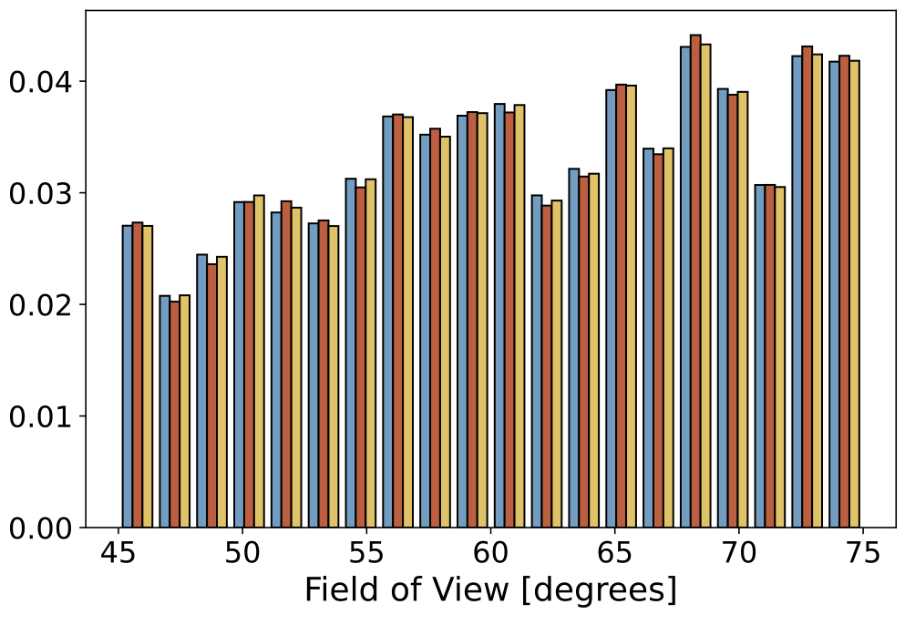
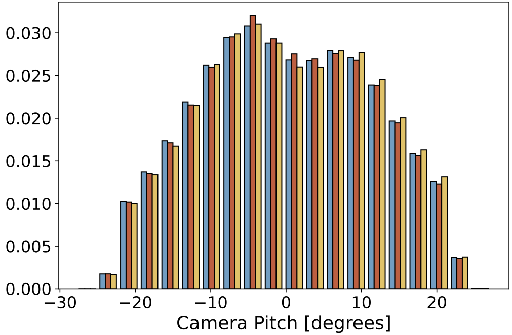
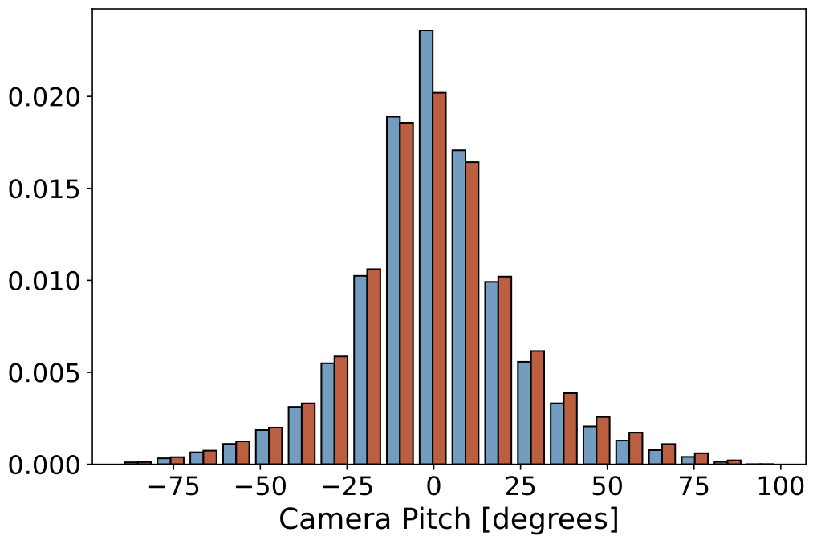
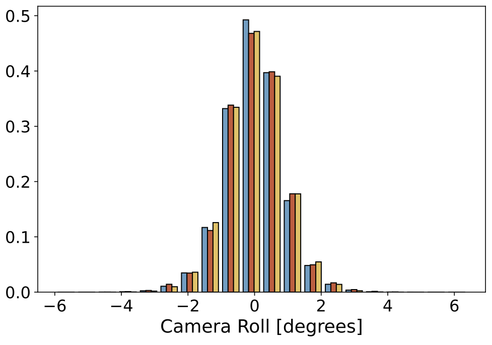
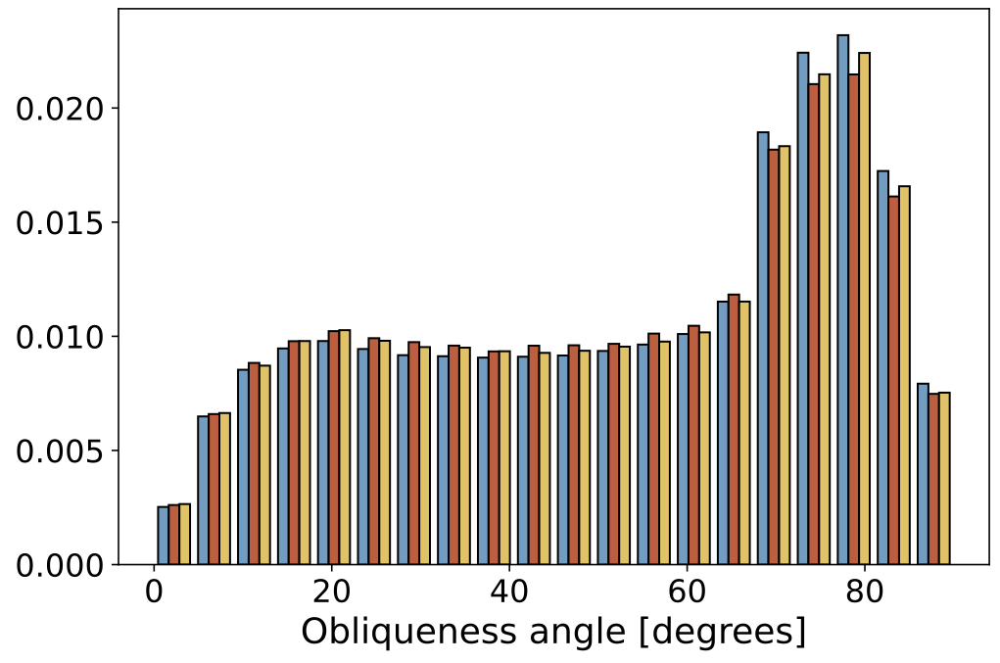
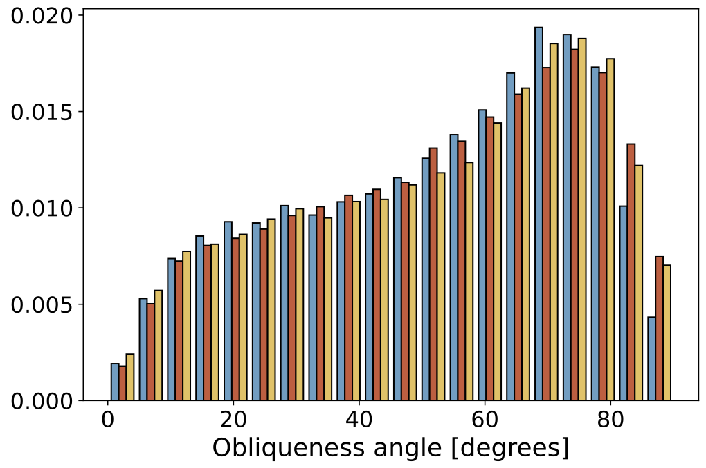
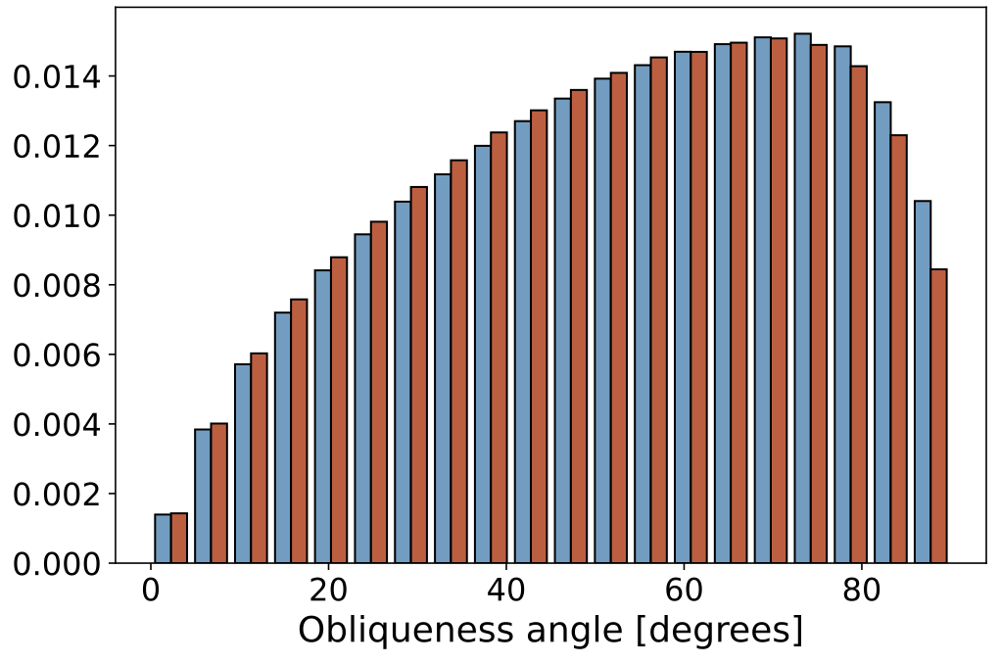
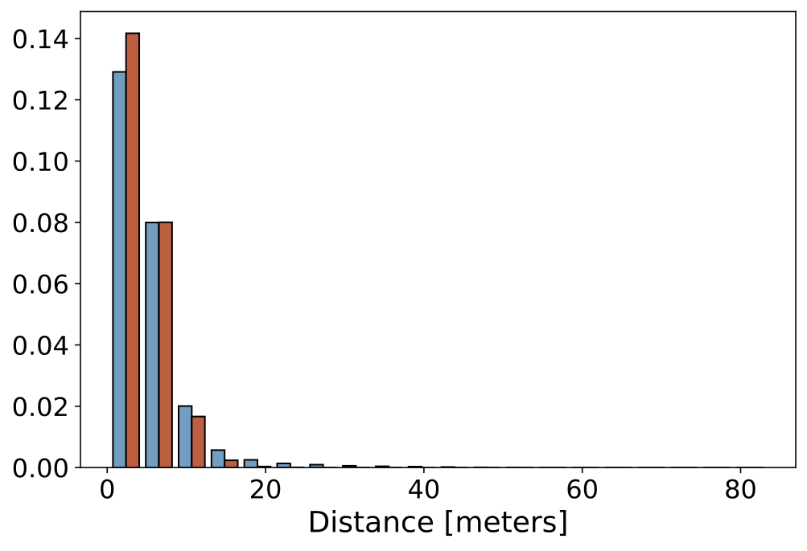
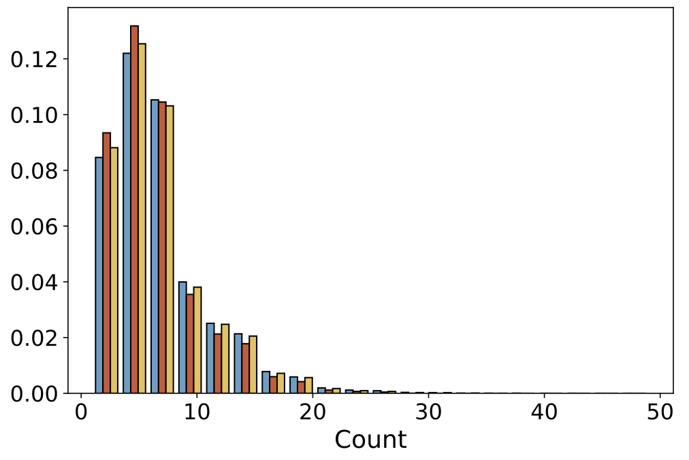

<div align="center">

# Omni ↦ Data (Under Construction)
**A Scalable Pipeline for Making Multi-Task Mid-Level Vision Datasets from 3D Scans**

  
[`Annotator Repo`](https://github.com/Ainaz99/omnidata-annotator) &centerdot; [**`>> [Starter Data] <<`**](https://github.com/EPFL-VILAB/omnidata-dataset) &centerdot;  [`Tooling + Training Repo`](https://github.com/Ainaz99/omnidata-tools) &centerdot;  [`Reference Code`](https://github.com/Ainaz99/Omnidata) &centerdot; [`Project Website`](https://omnidata.vision)

</div>

---

Omnidata Starter Dataset
=================


This repository contains the Starter Dataset generated by the Omnidata Annotator from our paper:

**Omnidata: A Scalable Pipeline for Making Multi-Task Mid-Level Vision Datasets from 3D Scans** (ICCV2021)

Table of Contents
=================
   * [Introduction](#introduction)
   * [Downloading the Full Starter Dataset](#downloading-the-full-dataset)
   * [Sample Data](#sample-data)
   * [Data Statistics](#data-statistics)
   * [Citing](#citation)

## Introduction:
We provide a Starter Dataset generated by Omnidata Pipeline from some existing 3D datasets. It contains more than `14 million` images from over `2000 spaces` with `21 different mid-level vision cues` per image. The dataset covers very diverse scenes (indoors and outdoors) and views (scene- and object-centric).

## Downloading the Full Dataset:
The full starter dataset will be available to download soon.

## Sample Data:
We provide a sample data from a random building in our **GSO + Replica** dataset split, which is created by scattering [Google Scanned Objects](https://app.ignitionrobotics.org/GoogleResearch/fuel/collections/Google%20Scanned%20Objects) around [Replica](https://github.com/facebookresearch/Replica-Dataset) buildings using the [Habitat](https://github.com/facebookresearch/habitat-sim) environment. This is only a sample scene (with mostly object-centric views) from over `2000 scenes` available in the full dataset.

You can download and untar the sample data with the following command:

```bash
wget https://drive.switch.ch/index.php/s/MkygxW0WLiLKsNz/download
tar -xf download
```

Now the sample dataset is available in the folder `omnidata_sample_dataset`.

| [Sample Data (GSO+Replica)](https://github.com/Ainaz99/omnidata-sample-data) | 
| :-------------: |
|  


## Data Statistics
|  | Taskonomy | Replica | GSO+Replica | HM3D |
| :-------------: |:-------------:|:-------------:|:-------------:|:-------------:| 
| Field of View |  |  |  |   |
| Camera Pitch | |  |  |   |
| Camera Roll |  |  |  |   | 
| Obliqueness Angle |  |  |  |   |
| Camera Distance |  |  |  |   |
| Views per Point |  |  |  |   |


## Citation
If you find this dataset useful in your research, please cite our paper:
```
@inproceedings{eftekhar2021omnidata,
  title={Omnidata: A Scalable Pipeline for Making Multi-Task Mid-Level Vision Datasets From 3D Scans},
  author={Eftekhar, Ainaz and Sax, Alexander and Malik, Jitendra and Zamir, Amir},
  booktitle={Proceedings of the IEEE/CVF International Conference on Computer Vision},
  pages={10786--10796},
  year={2021}
}
```
