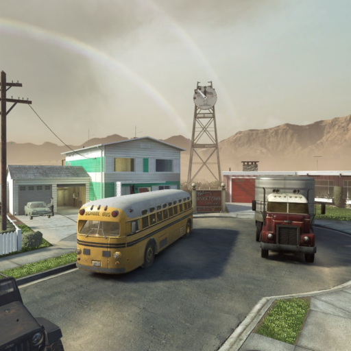
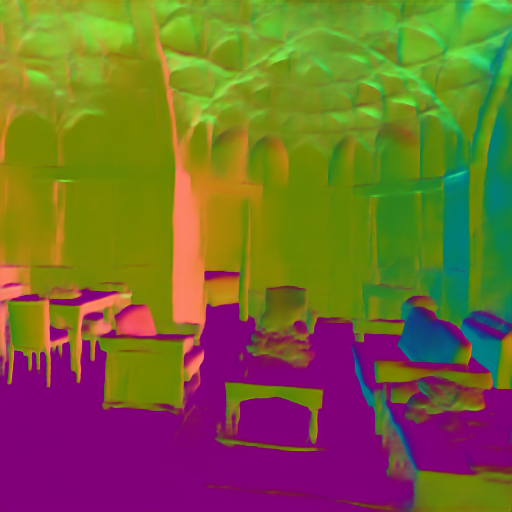
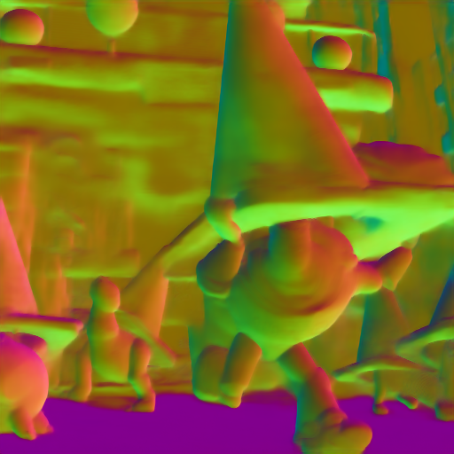
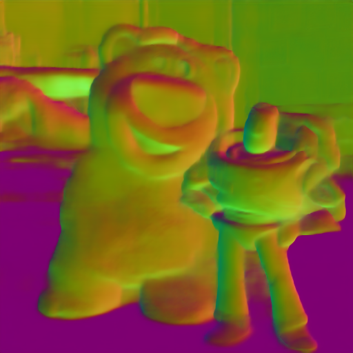
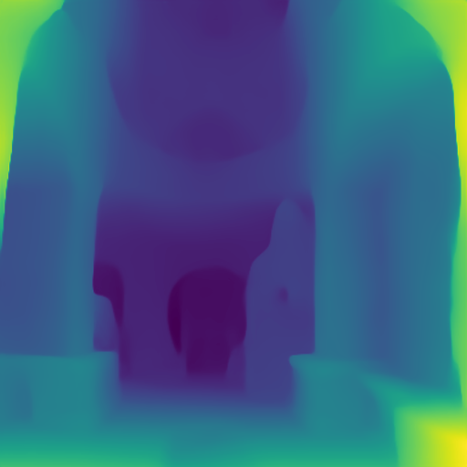
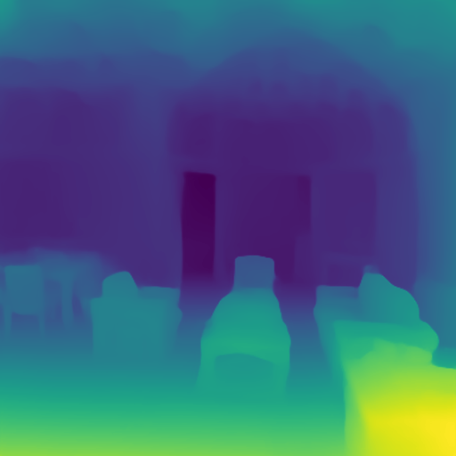
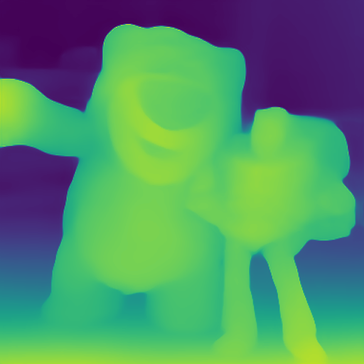
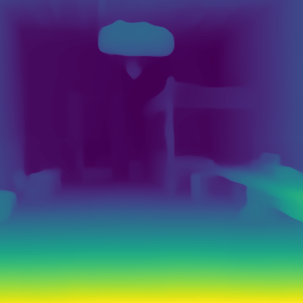

<div align="center">

# Omnidata (Steerable Datasets)
**A Scalable Pipeline for Making Multi-Task Mid-Level Vision Datasets from 3D Scans (ICCV 2021)**

  
[`Project Website`](https://omnidata.vision) &centerdot; [`Paper`](https://arxiv.org/abs/2110.04994) &centerdot; [**`>> [Github] <<`**](https://github.com/EPFL-VILAB/omnidata#readme) &centerdot; [`Data`](https://github.com/EPFL-VILAB/omnidata/tree/main/omnidata_tools/dataset#readme) &centerdot; [`Pretrained Weights`](https://github.com/EPFL-VILAB/omnidata-tools/tree/main/omnidata_tools/torch#readme) &centerdot; [`Annotator`](https://github.com/EPFL-VILAB/omnidata-tools/tree/main/omnidata_annotator#readme) &centerdot; 

</div>

---

Table of Contents
=================
- Pretrained models
    - [online demo](https://omnidata.vision/demo/) **[Updated Transormer models - Mar 2022]**
    - [weights and pytorch demo](https://github.com/EPFL-VILAB/omnidata/tree/main/omnidata_tools/torch#readme) **[Updated Transormer models - Mar 2022]**
    - [training](https://github.com/EPFL-VILAB/omnidata/tree/main/omnidata_tools/torch#training-state-of-the-art-models)
- Data 
    - [dataset info](https://github.com/EPFL-VILAB/omnidata/tree/main/omnidata_tools/dataset#readme)
    - [download standardized portions of the dataset](#dataset) **[Added [Hypersim](https://github.com/apple/ml-hypersim/issues/24) fix - Aug 2022]**
    - [configurable pytorch dataloaders](https://github.com/EPFL-VILAB/omnidata/tree/main/omnidata_tools/torch) **[Added multiview, mesh, camera parameters - Aug 2022]**
- The Pipeline
    - [generating more multi-view data](#create-multi-view-data-from-3d-mesh)
    - [online steerable dataset demo](https://omnidata.vision/designer/)
- [Source for all above](https://github.com/EPFL-VILAB/omnidata#source-code)
- [Paper code](https://github.com/EPFL-VILAB/omnidata/tree/main/paper_dump) ([#MiDaS loss](https://github.com/EPFL-VILAB/omnidata/tree/main/omnidata_tools/torch#midas-implementation))
- [Citing](https://github.com/EPFL-VILAB/omnidata/blob/main/README.md#citing)

---


### Pretrained models
Here is an [online demo](https://omnidata.vision/demo/) where you can upload your own images (1 per CAPTCHA). You can [download weights and code](https://github.com/EPFL-VILAB/omnidata/tree/main/omnidata_tools/torch#pretrained-models):
```bash
python demo.py --task depth --img_path $PATH_TO_IMAGE_OR_FOLDER --output_path $PATH_TO_SAVE_OUTPUT    # or TASK=normal
```
|  |   |   |   |  |  |  |
| :-------------:|:-------------:|:-------------:|:-------------:|:-------------:|:-------------:|:-------------:|
|  |  | |  |  | | |
|  |  | |  |  |  |  |
|  |  |  |  |  |  | 

---
<br>

## Dataset
You can download each component and modality individually or all at once with our download utility. [**MAIN DATA PAGE**](https://github.com/EPFL-VILAB/omnidata/tree/main/omnidata_tools/dataset#readme)
```bash
conda install -c conda-forge aria2
pip install 'omnidata-tools'

omnitools.download point_info rgb depth_euclidean mask_valid fragments \
    --components replica taskonomy \
    --subset debug \
    --dest ./omnidata_starter_dataset/ \
    --name YOUR_NAME --email YOUR_EMAIL --agree_all
```

We ran our annotation pipeline on several collections of 3D meshes. The result is a `24-million-viewpoint multiview dataset` comprising over `2000 scenes` with the following labels for each image:

#### Per-Image Information
|  |   |   |   |  |   |   |   | 
| :-------------------:|:---------------------:|:---------------------:|:-----------------------:| :-------------------:|:---------------------:|:---------------------:|:-----------------------:|
| RGB                    | Cam. Intrinsics          |  Cam. Pose                 |  Correspondences (Flow)      | Segm. <br> (Instances) |  Segm. <br> (Semantic)   |  Segm. <br> (2D Graphcut)  |  Segm. <br> (2.5D Graphcut)  | 
| Distance (Euclidean)  |  Depth (Z-Buffer)     |  Surface Normals      |  Curvature   |   Edges (Texture)      |  Shading (reshading)  |   Keypoints (2D, SIFT) |  Keypoints (3D, NARF) |
|  Masks (valid pixels) | Shading |   |  |   |   |   | 
  
`--components`: `Taskonomy`, `Hypersim`, `Replica`, `Google Scanned Objects in Replica`, `Habitat-Matterport3D`, `BlendedMVS`, `CLEVR`


`More about the data:` [Standardized data subsets and download tool](https://github.com/EPFL-VILAB/omnidata/tree/main/omnidata_tools/dataset#readme)


---

<br> 

## Annotate a new 3D mesh

```bash
git clone https://github.com/Ainaz99/omnidata-annotator # Generation scripts
docker pull ainaz99/omnidata-annotator:latest           # Includes Blender, Meshlab, other libs
docker run -ti --rm \
   -v omnidata-annotator:/annotator \
   -v PATH_TO_3D_MODEL:/model \
   ainaz99/omnidata-annotator:latest
cd /annotator
./run-demo.sh
```


Documentation and a tutorial [here](https://github.com/EPFL-VILAB/omnidata/tree/main/omnidata_annotator#readme).


<br>

## Source code
```bash
git clone https://github.com/EPFL-VILAB/omnidata
cd omnidata_tools/torch # PyTorch code for configurable Omnidata dataloaders, scripts for training, demo of trained models
cd omnidata_tools       # Code for downloader utility above, what's installed by: `pip install 'omnidata-tools'`
cd omnidata_annotator   # Annotator code. Docker CLI above
cd paper_code           # Reference

```

<br>


<br>

## Citing
```
@inproceedings{eftekhar2021omnidata,
  title={Omnidata: A Scalable Pipeline for Making Multi-Task Mid-Level Vision Datasets From 3D Scans},
  author={Eftekhar, Ainaz and Sax, Alexander and Malik, Jitendra and Zamir, Amir},
  booktitle={Proceedings of the IEEE/CVF International Conference on Computer Vision},
  pages={10786--10796},
  year={2021}
}
```
In case you use our latest pretrained models please also cite the following paper for 3D data augmentations:
```
@inproceedings{kar20223d,
  title={3D Common Corruptions and Data Augmentation},
  author={Kar, O{\u{g}}uzhan Fatih and Yeo, Teresa and Atanov, Andrei and Zamir, Amir},
  booktitle={Proceedings of the IEEE/CVF Conference on Computer Vision and Pattern Recognition},
  pages={18963--18974},
  year={2022}
}
```
<!--  -->
> ...were you looking for the [research paper](//omnidata.vision/#paper) or [project website](//omnidata.vision)? 
