<div align="center">

# Omnidata: _Annotator CLI and source_

[`Project Website`](https://omnidata.vision) &centerdot; [`Paper`](https://arxiv.org/abs/2110.04994) &centerdot; [`Docs`](//docs.omnidata.vision) &centerdot; [**`>> [Annotator] <<`**](https://github.com/EPFL-VILAB/omnidata-tools/tree/main/omnidata_annotator) &centerdot; [`Starter Data`](//docs.omnidata.vision/starter_dataset.html) &centerdot;  [`Tools`](https://github.com/EPFL-VILAB/omnidata-tools/tree/main/omnidata_tools/torch) &centerdot; [`Paper Code`](https://github.com/Ainaz99/Omnidata)

**Omnidata: A Scalable Pipeline for Making Multi-Task Mid-Level Vision Datasets from 3D Scans**

</div>

---

Omnidata Annotator
=================

The repository contains the dockerized Omnidata annotator pipeline introduced in the following paper:
**Omnidata: A Scalable Pipeline for Making Multi-Task Mid-Level Vision Datasets from 3D Scans** (ICCV2021)

Table of Contents
=================
   * [Introduction](#introduction)
   * [Installation](#installation)
   * [Quickstart (Run demo)](#quickstart-run-demo)
   * [Documentation](#documentation)
   * [Citing](#citation)


## Introduction 
The Omnidata annotator is a pipeline to bridge the gap between 3D scans and static vision datasets by creating "steerable" multi-task datasets with 21 different mid-level cues from 3D meshes. It generates the data with as many images and cameras as desired to cover the space. The rendering pipeline offers complete control over the sampling and generation process, and different dataset design choices such as camera parameters. 13 of the 21 mid-level cues are listed below:
```bash
RGB (8-bit)              Surface Normals (8-bit)     Principal Curvature (8-bit)
Re(shading) (8-bit)      Depth Z-Buffer (16-bit)     Depth Euclidean (16-bit)
Texture Edges (16-bit)   Occlusion Edges (16-bit)    Keypoints 2D (16-bit)
Keypoints 3D (16-bit)    2D Segmentation (8-bit)     2.5D Segmentation (8-bit)
Semantic Segmentation (8-bit)
```

## Installation
We provide a docker that contains the code for the annotator and all the necessary libraries and softwares. 

1. Clone the Repo:
```bash
git clone https://github.com/Ainaz99/omnidata-annotator
```
2. Run the Docker and mount the directories containing the code and your 3D model in the container: 
```bash
docker pull ainaz99/omnidata-annotator:latest
docker run -ti --rm -v PATH_TO_ANNOTATOR:/annotator -v PATH_TO_3D_MODEL:/model ainaz99/omnidata-annotator:latest
```
The code for the annotator and the 3D model are now available in the docker under the directories `/annotator` and `/model` respectively. All the necessary libraries and softwares are already installed in the docker. Now, the model can be processed with a single line of bash inside the container.


## Quickstart (run demo)
We now run the pipeline on a sample 3D mesh from the Habitat-Matterport 3D datast. You can download it from [here](https://drive.google.com/file/d/1B1Zxur6ywvpOpfQb49CQB_yW7jj4Ynnk/view?usp=sharing). After running the docker container, the mesh will be available under the `/model` directory.
By running the following command you can generate a small sample dataset with 12 mid-level cues per each image. (Estimated run time: up to 10 minutes)

``` bash
cd /annotator
./run-demo.sh
```

```diff
- RGB:
```
|  |  |  |  |  |
| :-------------: |:-------------:|:-------------:|:-------------:|:-------------:|
| 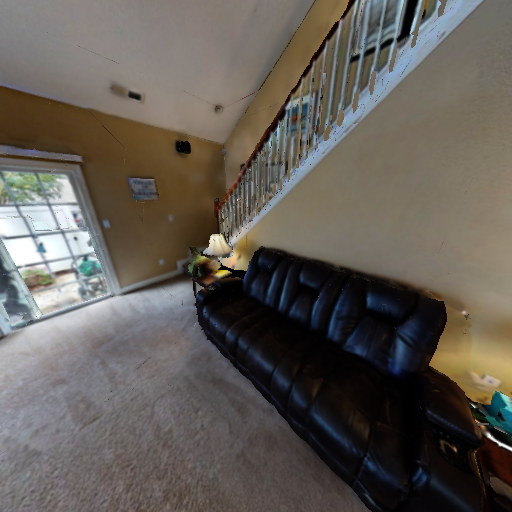 | 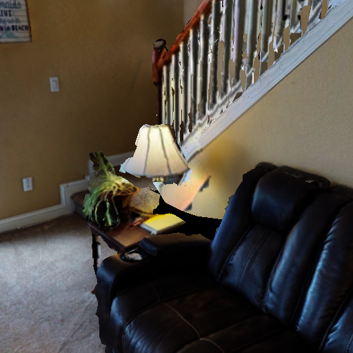 | 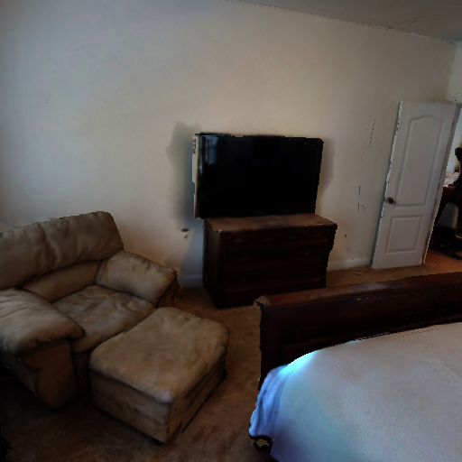 | 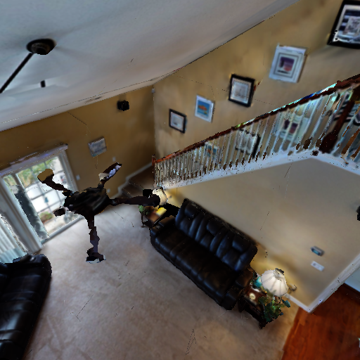  | 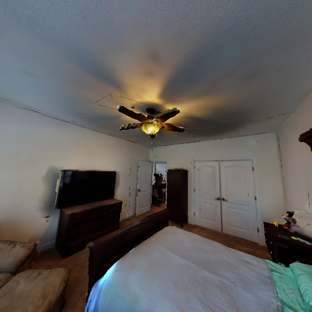 


```diff
- Surface Normals:
```
|  |  |  |  |  |
| :-------------: |:-------------:|:-------------:|:-------------:|:-------------:|
| 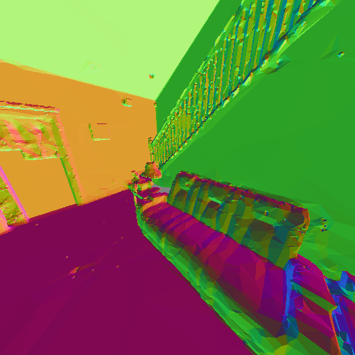 | 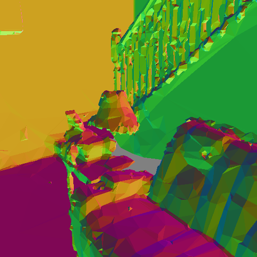 |  | 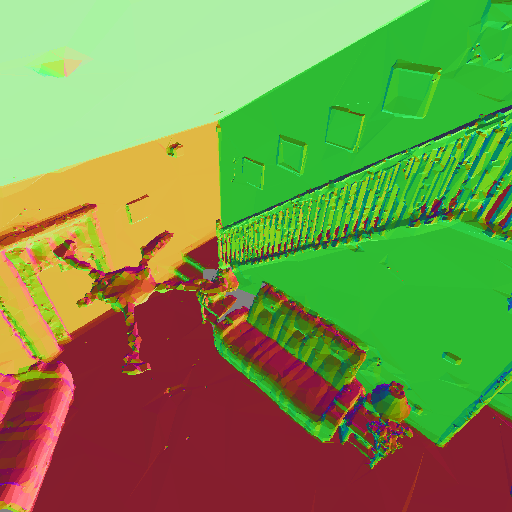  |  


```diff
- Depth Zbuffer:
```
|  |  |  |  |  |
| :-------------: |:-------------:|:-------------:|:-------------:|:-------------:|
|  |  |  |   |  


```diff
- Reshading:
```
|  |  |  |  |  |
| :-------------: |:-------------:|:-------------:|:-------------:|:-------------:|
| 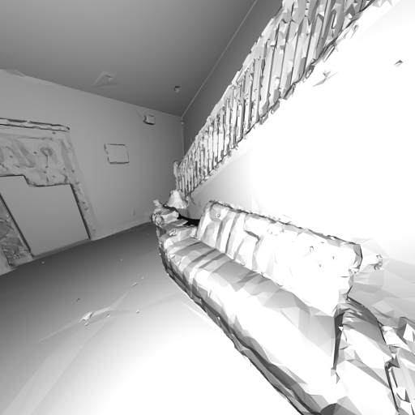 | 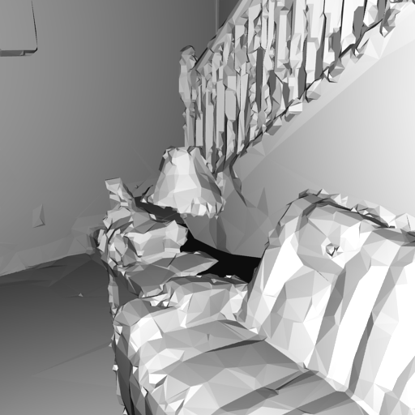 | 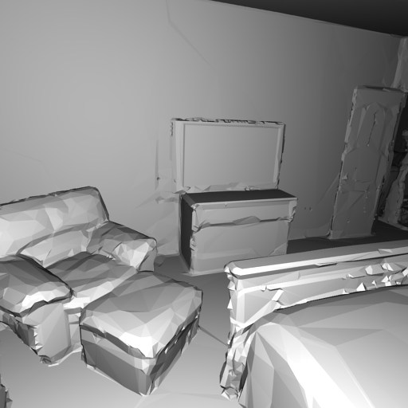 | 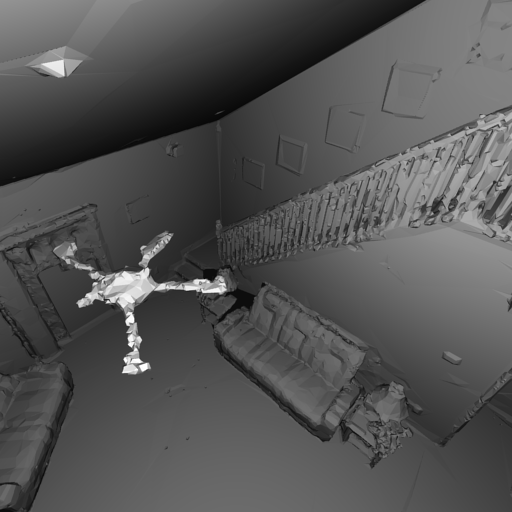  | 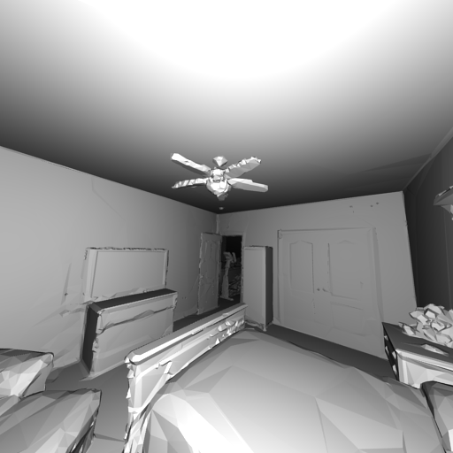 

```diff
- Texture Edges:
```
|  |  |  |  |  |
| :-------------: |:-------------:|:-------------:|:-------------:|:-------------:|
| 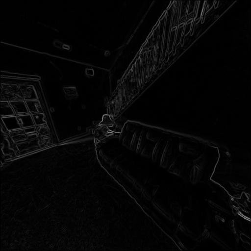 | 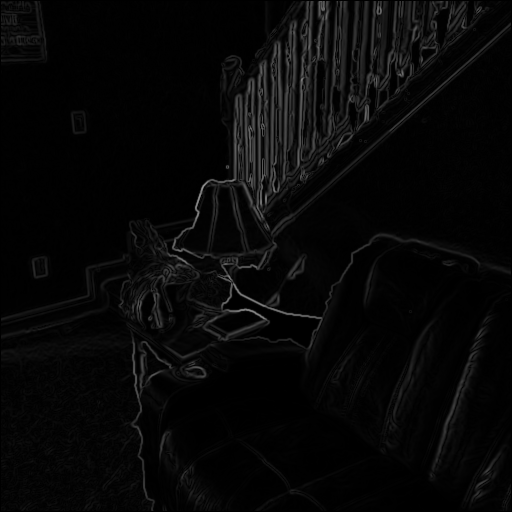 | 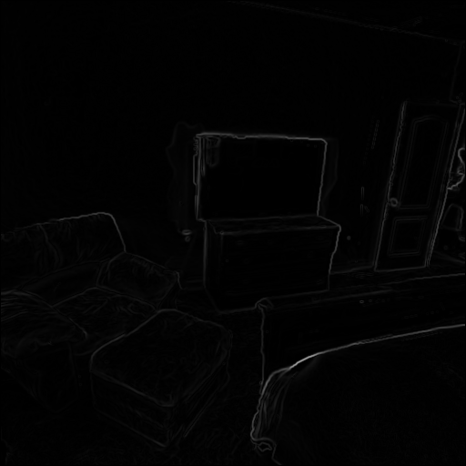 | 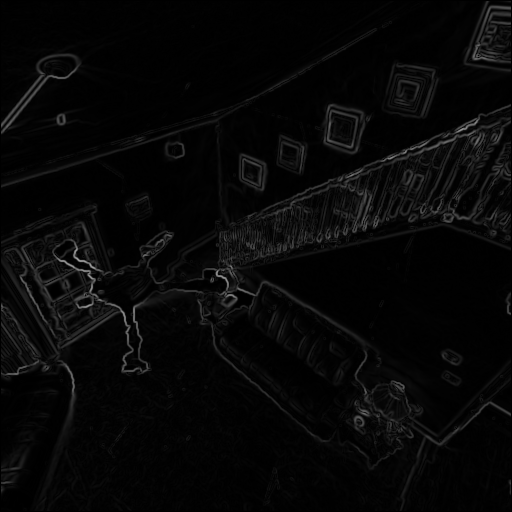  | 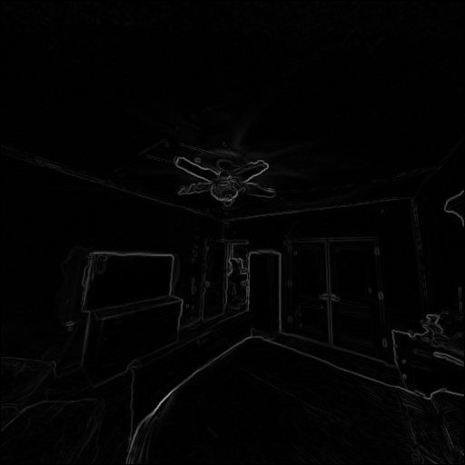 

```diff
- 3D Keypoints:
```
|  |  |  |  |  |
| :-------------: |:-------------:|:-------------:|:-------------:|:-------------:|
| 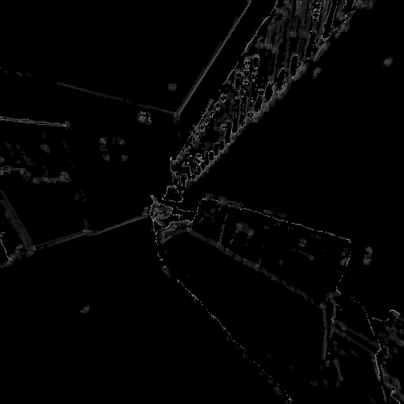 | 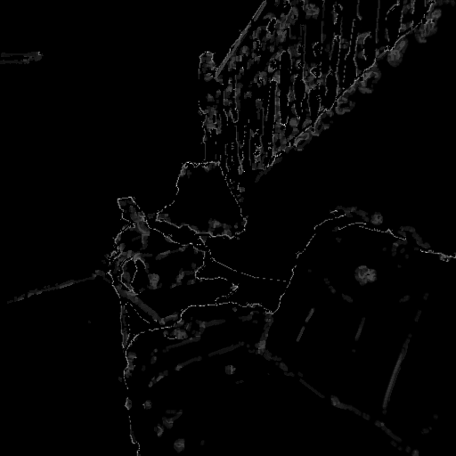 | 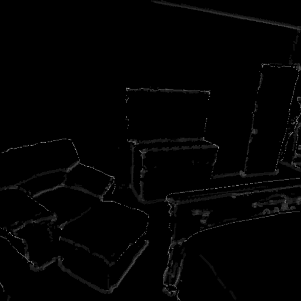 | 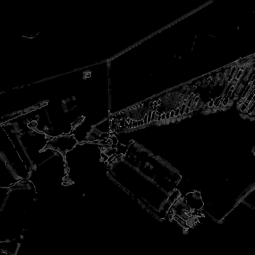  | 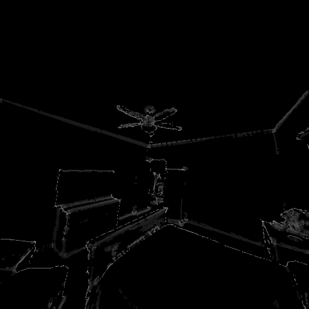 

```diff
- 2.5D Segmentation:
```
|  |  |  |  |  |
| :-------------: |:-------------:|:-------------:|:-------------:|:-------------:|
| 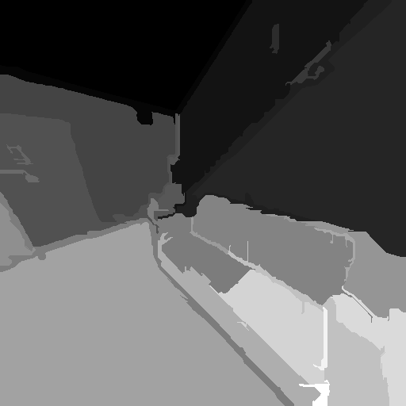 | 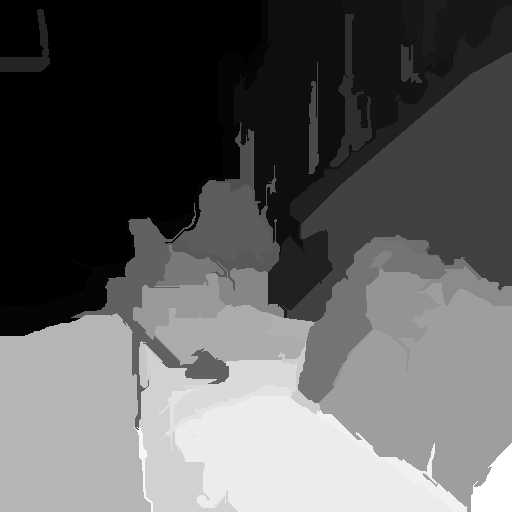 | 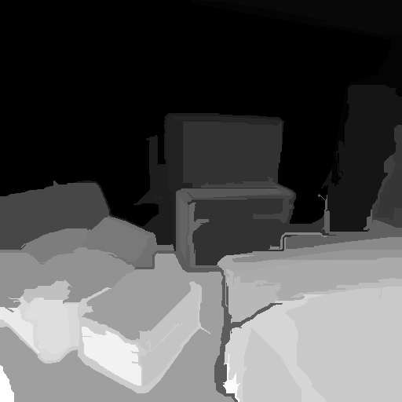 | 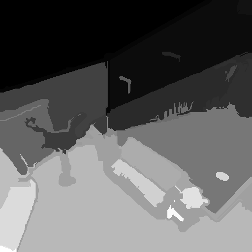  | 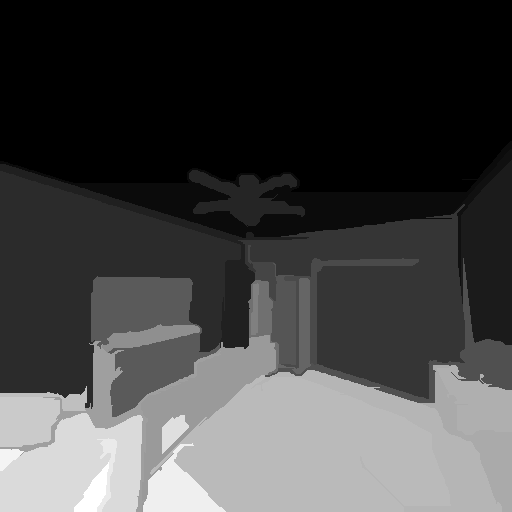 

## Documentation:
Now we provide a brief documentation on how to run the the pipeline for each of the tasks.

| Surface Normals | Euclidean Depth | Semantics  |
| :-------------: |:-------------:| :-----:|
| 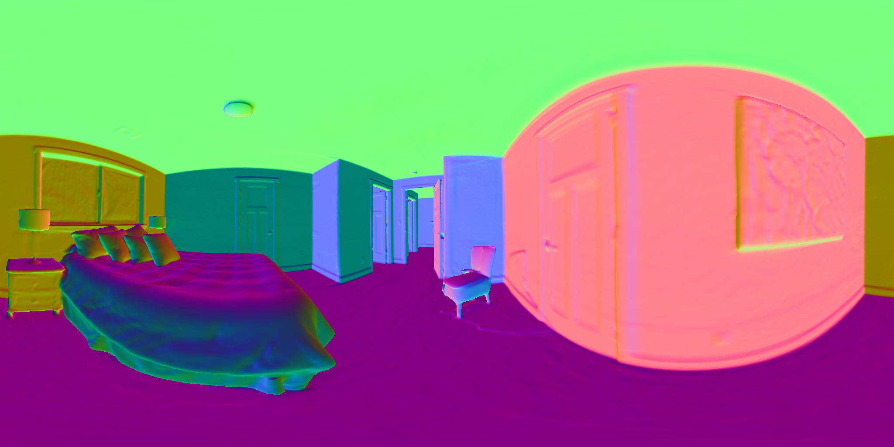 |  | 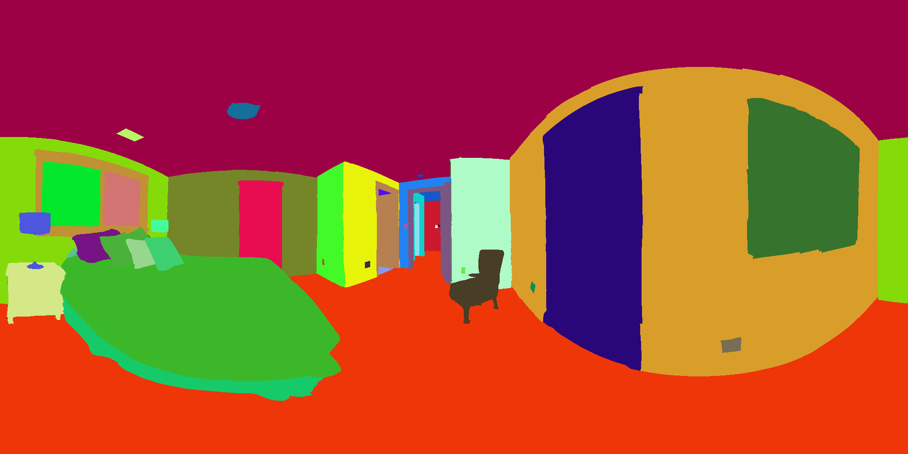 |
| 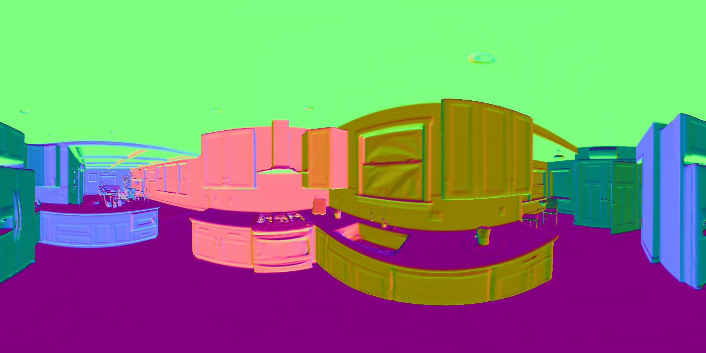 |  | 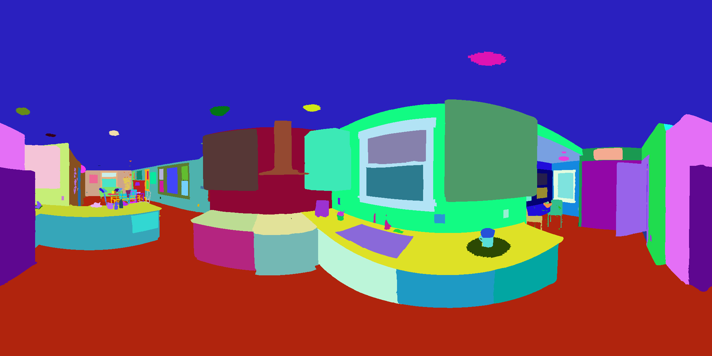


**To generate a specific mid-level cue with the Omnidata annotator, use a single command in the format below:**
``` bash
cd /annotator
./omnidata-annotate.sh --model_path=/model --task=$TASK with {$SETTING=$VALUE}*
```
The `--model_path` tag specifies the path to the folder containing the mesh, where the data from all other mid-level cues will be saved, and the `--task` tag specifies the target mid-level cue.
You can specify different setting values for each task in the command. The list of all settings defined for different mid-level cues is found in `scripts/settings.py`.

The final folder structure will be as follows:
```bash
model_path
│   mesh.ply
│   mesh_semantic.ply
│   texture.png
│   camera_poses.json   
└─── point_info
└─── rgb
└─── normals
└─── depth_zbuffer
│   ...
│   
└─── pano
│   └─── point_info
│   └─── rgb
│   └─── normal
│   └─── depth_euclidean
```

Now, we run the annotator for different tasks.

##  Wide-Baseline Multi-View:
The first method of view sampling generates static images by saving fixated views of the points-of-interest.

### 1. Camera and Point-of-Interest Sampling:
Camera poses can be provided by a `json` file (if the mesh comes with aligned RGB), or you can generate dense camera locations using the pipeline with `Poisson Disc Sampling`. Points-of-interest are then sampled from the mesh subject to multi-view constraints.

#### Read camera poses from json file:
The following command samples 20 points-of-interest using the camera poses defined in `camera_poses_original.json`.
```bash
./omnidata-annotate.sh --model_path=/model --task=points \
   with GENERATE_CAMERAS=False CAMERA_POSE_FILE=camera_poses_original.json \
        MIN_VIEWS_PER_POINT=3  NUM_POINTS=20 \
        MODEL_FILE=mesh.ply    POINT_TYPE=CORRESPONDENCES
```
In order to read the camera poses from the json file, you should specify `GENERATE_CAMERAS=False`. This json file should contain `location` and `quaternion rotation (wxyz)` for a list of cameras. Below, you can see how this information should be saved for each camera.

```javascript
{
    "camera_id": "0000",
    "location": [0.2146, 1.2829, 0.2003],
    "rotation_quaternion": [0.0144, -0.0100, -0.0001,-0.9998]
}
```
You can specify the type of generated points. `POINT_TYPE=CORRESPONDENCES` is used for generating fixated views of the points. Switch to `POINT_TYPE=SWEEP` in case you want to generate panoramas.
#### Sample dense camera poses:
You can sample new camera poses before sampling the points-of-interest using `GENERATE_CAMERAS=True`.
There are 2 ways of generating the camera poses depending on wether the mesh is a scene (like in Replica) or is an object (Google Scanned Objects).

##### Sample camera poses inside a scene:
In this case, you have to specify `SCENE=True`.

```bash
./omnidata-annotate.sh --model_path=/model --task=points \
   with GENERATE_CAMERAS=True     SCENE=True \
        MIN_CAMERA_HEIGHT=1       MAX_CAMERA_ROLL=10 \
        MIN_CAMERA_DISTANCE=1.5     MIN_CAMERA_DISTANCE_TO_MESH=0.3 \
        MIN_VIEWS_PER_POINT=3     POINTS_PER_CAMERA=3 \
        MODEL_FILE=mesh.ply       POINT_TYPE=CORRESPONDENCES

```
Camera locations are sampled inside the mesh using **Poisson Disc Sampling** to cover the space. Minimum distance between cameras is specified by `MIN_CAMERA_DISTANCE`. `MIN_CAMERA_DISTANCE_TO_MESH` defines the minimum distance of each camera to the closest point of the mesh.
Camera `yaw` is sampled uniformly in `[-180°, 180°]`, camera `roll` comes from a truncated normal distribution in `[-MAX_CAMERA_ROLL, MAX_CAMERA_ROLL]`, and camera `pitch` will be specified automatically when fixating the camera on a point-of-interest.
More camera settings such as  `MIN_CAMERA_HEIGHT`,  `MAX_CAMERA_HEIGHT`, etc. are defined in `settings.py`.
You can specify the number of generated points either by `NUM_POINTS` or `NUM_POINTS_PER_CAMERA`. In case we have `NUM_POINTS=None`, the number of generated points will be `NUM_POINTS_PER_CAMERA * number of cameras`.

##### Generate camera poses for an object:
If the mesh is an object you have to specify `SCENE=False`. In this case, camera locations will be sampled on a `sphere` surrounding the mesh. `SPHERE_SCALING_FACTOR` will specify the scaling factor of this sphere relative to the smallest bounding sphere of the mesh. You can specify the number of generated cameras by `NUM_CAMERAS`. Camera rotations will be sampled the same as above.

```bash
./omnidata-annotate.sh --model_path=/model --task=points \
  with GENERATE_CAMERAS=True    SCENE=False \
       NUM_CAMERAS=12           MAX_CAMERA_ROLL=10 \
       POINTS_PER_CAMERA=5      MIN_VIEWS_PER_POINT=3 \
       MODEL_FILE=model.obj     SPHERE_SCALING_FACTOR=2
```

|  |  |  |  |  |
| :-------------: |:-------------:|:-------------:|:-------------:|:-------------:|
| 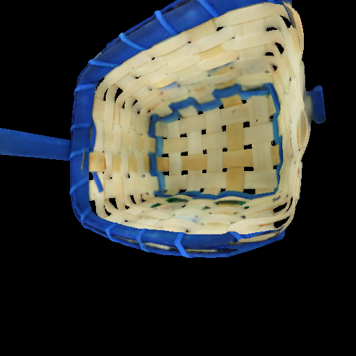 | 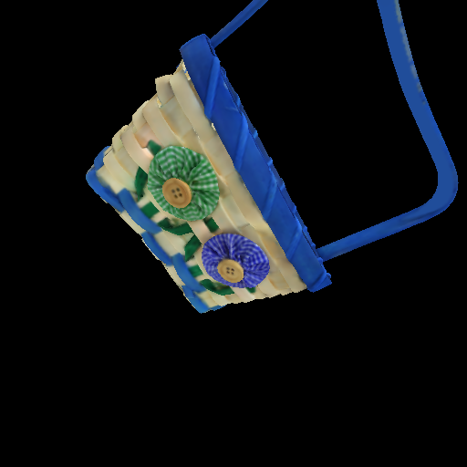 | 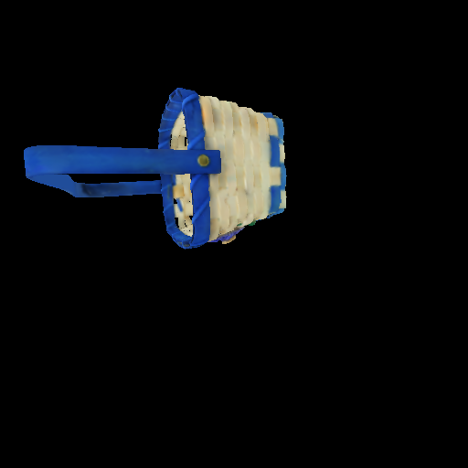 |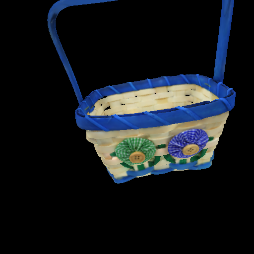 |  

### 2. RGB:
RGB images can be generated if textures are provided as obj + mtl files. You should use `mesh.obj` instead of the `ply` file. Make sure to set the correct `OBJ_AXIS_FORWARD` and `OBJ_AXIS_UP` to be consistent with `mesh.ply`. Notice that you should specify the value for `RGB_MODEL_FILE` instead of `MODEL_FILE` which is used for other tasks.

```bash
./omnidata-annotate.sh --model_path=/model --task=rgb \
    with RGB_MODEL_FILE=mesh.obj  CREATE_FIXATED=True \
         OBJ_AXIS_FORWARD=Y       OBJ_AXIS_UP=Z  
```
|  |  |  |  | 
| :-------------: |:-------------:|:-------------:|:-------------:|
| 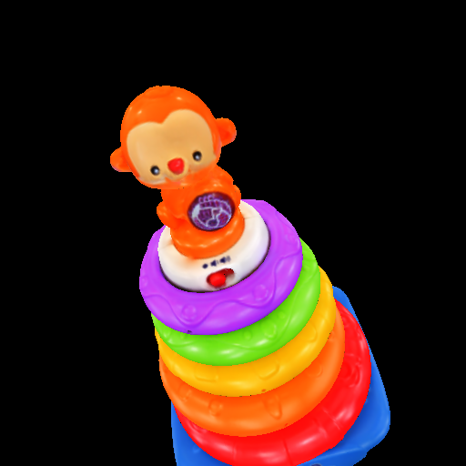 |  | 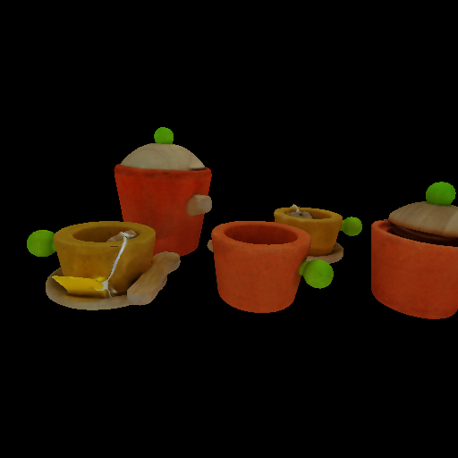 |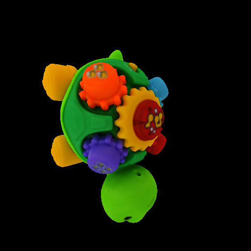


### 3. Surface Normals:

In order to generate surface normal images simply run:
```bash
./omnidata-annotate.sh --model_path=/model --task=normal \
    with MODEL_FILE=mesh.ply  CREATE_FIXATED=True
```
This will generate fixated views.

| Replica | Clevr | Google Objects  | Replica+GSO  | BlendedMVG  |
| :-------------: |:-------------:|:-------------:|:-------------:|:-------------:|
| 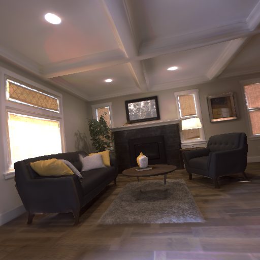 | 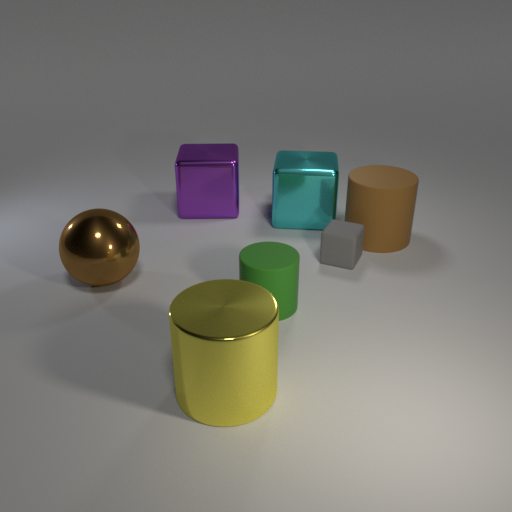 |  |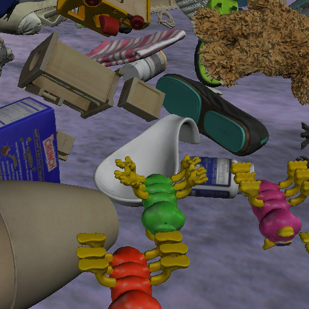 |  |
| 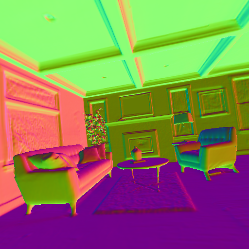 | 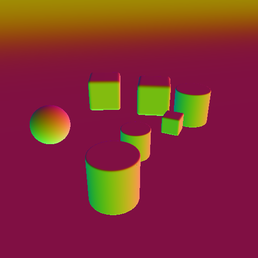 | 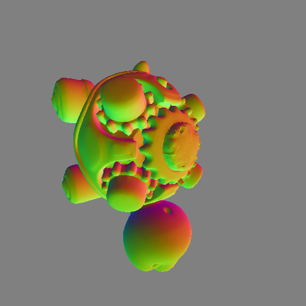|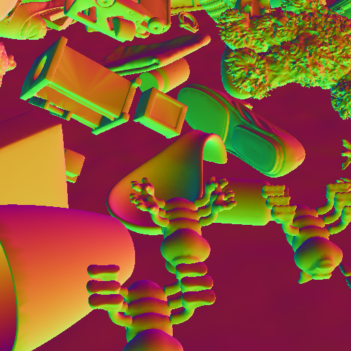 | 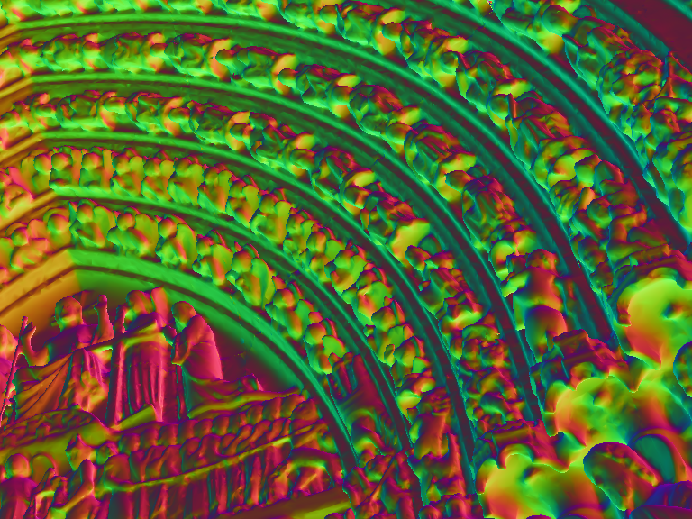


In case you want to generate panoramas switch to `CREATE_FIXATED=False`  and `CREATE_PANOS=True`:
```bash
./omnidata-annotate.sh --model_path=/model --task=normal \
    with MODEL_FILE=mesh.ply CREATE_FIXATED=False CREATE_PANOS=True
```

```diff
- HM3D Output:
```

|  |  |  |
| :-------------: |:-------------:|:-------------:|
| 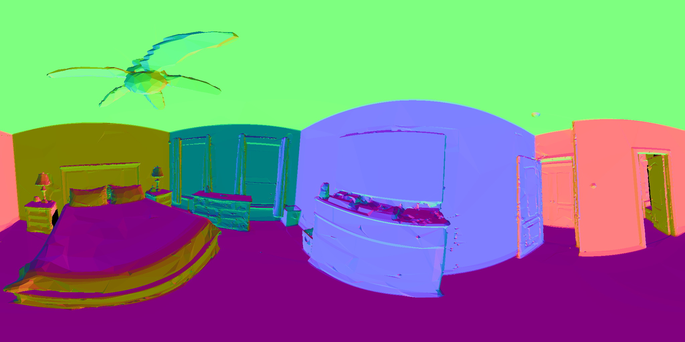 | 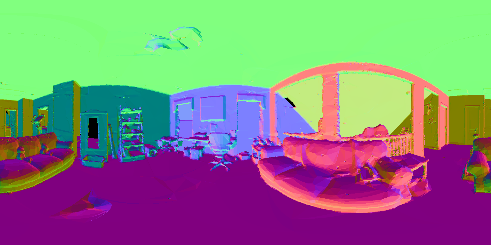 | 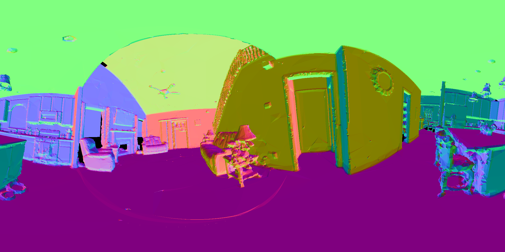 


### 4. Depth ZBuffer:
To generate depth zbuffer images :
```bash
./omnidata-annotate.sh --model_path=/model --task=depth_zbuffer \
    with MODEL_FILE=mesh.ply  DEPTH_ZBUFFER_MAX_DISTANCE_METERS=8
```
ZBuffer depth is defined as the distance to the camera plane. The depth sensitivity is specified by the maximum depth in meters. With 16-bit images and `DEPTH_ZBUFFER_MAX_DISTANCE_METERS` equal to 16m, the depth sensitivity will be 16 / 2^16 = 1/4096 meters. Pixels with maximum depth value (2^16) indicate the invalid parts of the image (such as mesh holes). You can create masks indicating the valid parts of each image after generating depth Zbuffer images using the following command (these masks are shown in the 3rd row of the table below):
```bash
./omnidata-annotate.sh --model_path=/model --task=mask_valid 
```

| Replica | Google Objects  | Hypersim  | BlendedMVG  |
| :-------------:|:-------------:|:-------------:|:-------------:|
|  |  | |  |
|  | | |  |
|  | | | 


### 5. Depth Euclidean:
To generate depth euclidean images :
```bash
./omnidata-annotate.sh --model_path=/model --task=depth_euclidean \
    with MODEL_FILE=mesh.ply  DEPTH_EUCLIDEAN_MAX_DISTANCE_METERS=8
```
Euclidean depth is measured as the distance from each pixel to the camera’s optical center. You can specify depth sensitivity the same as depth Zbuffer.

| Taskonomy | Clevr  | BlendedMVG  |
| :-------------:|:-------------:|:-------------:|
|  |  | |
|  |  | 

### 6. Re(shading):
To generate reshading images :
```bash
./omnidata-annotate.sh --model_path=/model --task=reshading \
    with MODEL_FILE=mesh.ply  LAMP_ENERGY=2.5
```


| Taskonomy | Google Objects  | Hypersim  |
| :-------------:|:-------------:|:-------------:|
|  |  |  |
|  |  | 


### 7. Principal Curvature:
To generate principal curvature run:

```bash
./omnidata-annotate.sh --model_path=/model --task=curvature with MIN_CURVATURE_RADIUS=0.03
```

| Taskonomy | Replica |
| :---:|:---:|
|  |  |
|  |  

```diff
- HM3D Output:
```
Not working for HM3D meshes!

### 8. Keypoints 2D:
2D keypoints are generated from corresponding `RGB` images for each point and view. You can generate 2D keypoint images using the command below :

```bash
./omnidata-annotate.sh --model_path=/model --task=keypoints2d
```

### 9. Keypoints 3D:
3D keypoints are similar to 2D keypoints except that they are derived from 3D data. Therefore you have to generate `depth_zbuffer` images before generating 3D keypoints.
To generate 3D keypoint images use the command below:
```bash
./omnidata-annotate.sh --model_path=/model --task=keypoints3d \
    with KEYPOINT_SUPPORT_SIZE=0.3
```
`KEYPOINT_SUPPORT_SIZE` specifies the diameter of the sphere around each 3D point that is used to decide if the point should be a keypoint. 0.3 meters is suggested for indoor spaces.

| Replica | Clevr | Hypersim  | BlendedMVG  |
| :-------------: |:-------------:|:-------------:|:-------------:|
|  |  | |  |
|  |  |  | 


### 10. Texture Edges:
Texture(2D) Edges are computed from corresponding `RGB` images using **Canny edge detection** algorithm. To generate 2D edges:
```bash
./omnidata-annotate.sh --model_path=/model --task=edge2d \
    with CANNY_RGB_BLUR_SIGMA=0.5
```
`CANNY_RGB_BLUR_SIGMA` specifies the sigma in Gaussian filter used in Canny edge detector.

| Replica | Clevr | Replica+GSO |
| :-------------: |:-------------:|:-------------:|
|  |  ||
|  |  |  


### 11. Occlusion Edges:
Occlusion(3D) Edges are derived from `depth_zbuffer` images, so you have to generate those first. To generate 3D edges :
```bash
./omnidata-annotate.sh --model_path=/model --task=edge3d
  with EDGE_3D_THRESH=None
```

### 12. 2D Segmentation:
2D Segmentation images are generated using **Normalized Cut** algorithm from corresponding `RGB` images:
```bash
./omnidata-annotate.sh --model_path=/model --task=segment2d \
  with SEGMENTATION_2D_BLUR=3     SEGMENTATION_2D_CUT_THRESH=0.005  \
       SEGMENTATION_2D_SCALE=200  SEGMENTATION_2D_SELF_EDGE_WEIGHT=2
```

### 13. 2.5D Segmentation:
2.5D Segmentation uses the same algorithm as 2D, but the labels are computed jointly from `occlusion edges`, `depth zbuffer `, and `surface normals`. 2.5D segmentation incorporates information about the scene geometry that is not directly present in the `RGB` image.
To generate 2.5D segmentation images :
```bash
./omnidata-annotate.sh --model_path=/model --task=segment25d \
  with SEGMENTATION_2D_SCALE=200        SEGMENTATION_25D_CUT_THRESH=1  \
       SEGMENTATION_25D_DEPTH_WEIGHT=2  SEGMENTATION_25D_NORMAL_WEIGHT=1 \
       SEGMENTATION_25D_EDGE_WEIGHT=10
```
You can specify the weights for each of the `occlusion edges`, `depth zbuffer`, and `surface normal` images used in 2.5D segmentation algorithm by `SEGMENTATION_25D_EDGE_WEIGHT`, `SEGMENTATION_25D_DEPTH_WEIGHT`, and `SEGMENTATION_25D_NORMAL_WEIGHT` respectively.


| Replica | Google Objects | Hypersim |
| :-------------: |:-------------:|:-------------:|
||||
|  |  ||
|  |  |  


### 14. Semantic Segmentation:
Semantic segmentation images can be generated similar to rgb from obj+mtl files. You can run the following command:
```bash
./omnidata-annotate.sh --model_path=/model --task=semantic \
  with SEMANTIC_MODEL_FILE=mesh_semantic.obj
```
Notice that you should specify the value for `SEMANTIC_MODEL_FILE` instead of `MODEL_FILE` which was used for other tasks.

| Replica | Taskonomy  | Replica+GSO  | Hypersim  |
| :-------------:|:-------------:|:-------------:|:-------------:|
|  |  | |  |
|  | | | 


```diff
- HM3D Output:
```
Habitat-Matterport doesn't include the semantic annotations.


##  Smooth Trajectory Sampling:
Videos can be generated by saving views along a path interpolated between a subset of cameras with fixated views of a point. Each generated trajectory corresponds to a single point.

### - Camera and Point-of-Interest Sampling:
Camera poses can be provided or generated the same as before. To generate the points for smooth trajectory sampling run the following command:
```bash
./omnidata-annotate.sh --model_path=/model --task=points_trajectory \
  with  MIN_CAMERA_DISTANCE=1.5      POINTS_PER_CAMERA=2\
        FIELD_OF_VIEW_MIN_RADS=1.57  FIELD_OF_VIEW_MAX_RADS=1.57 \
        GENERATE_CAMERAS=True        MIN_VIEWS_PER_POINT=4     
```
Camera FOV should stay the same along the trajectory. Make sure to have `FIELD_OF_VIEW_MAX_RADS=FIELD_OF_VIEW_MIN_RADS` and `MIN_VIEWS_PER_POINT>1`.

### - Other tasks:
You can generate the rest of the mid-level tasks for each video frame the same as before with `CREATE_TRAJECTORY=True`. For example:
```bash
./omnidata-annotate.sh --model_path=/model --task=normal with CREATE_TRAJECTORY=True
```

You can run the following command to generate a video from the frames for a specific `task` (e.g. normal) and `point` (e.e. 5).
```bash
ffmpeg -y -framerate 22 -pattern_type glob \
    -i "/model/{$TASK}/point_{$POINT}_*.png" \
    -c:v libx264 -crf 17  -pix_fmt yuv420p "/model/point_{$POINT}_{$TASK}.mp4";
```

```diff
- HM3D Output:
```

|  |  |  |
| :-------------: |:-------------:| :-----:|
|  |  |  |
|  |  | 


## Citation
If you use the annotator, please cite our paper:
```
@inproceedings{eftekhar2021omnidata,
  title={Omnidata: A Scalable Pipeline for Making Multi-Task Mid-Level Vision Datasets From 3D Scans},
  author={Eftekhar, Ainaz and Sax, Alexander and Bachmann, Roman and Malik, Jitendra and Zamir, Amir},
  booktitle={Proceedings of the IEEE/CVF International Conference on Computer Vision},
  pages={10786--10796},
  year={2021}
}
```
