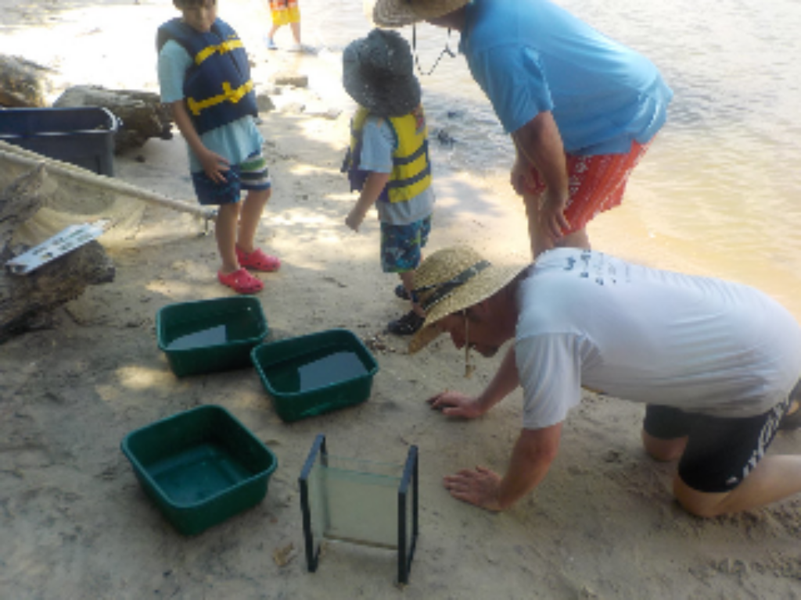
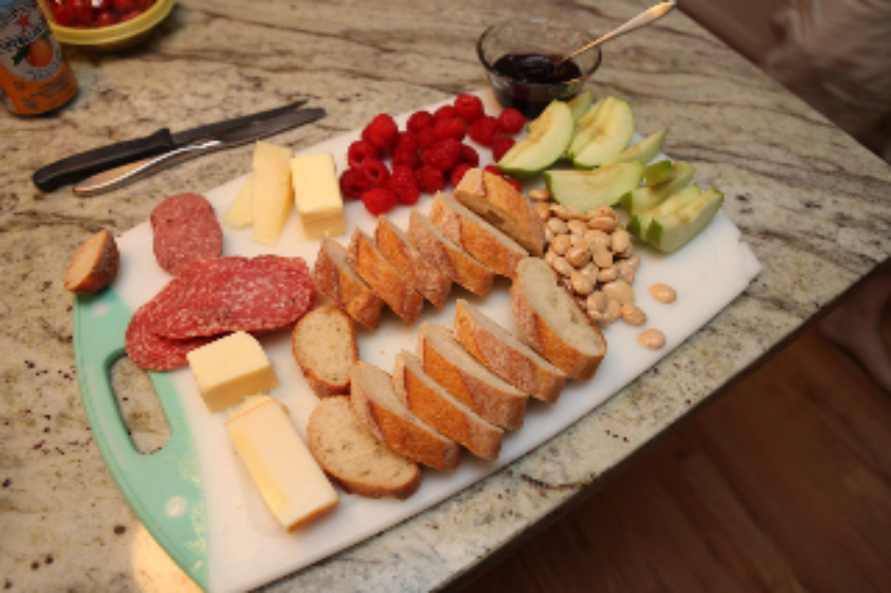
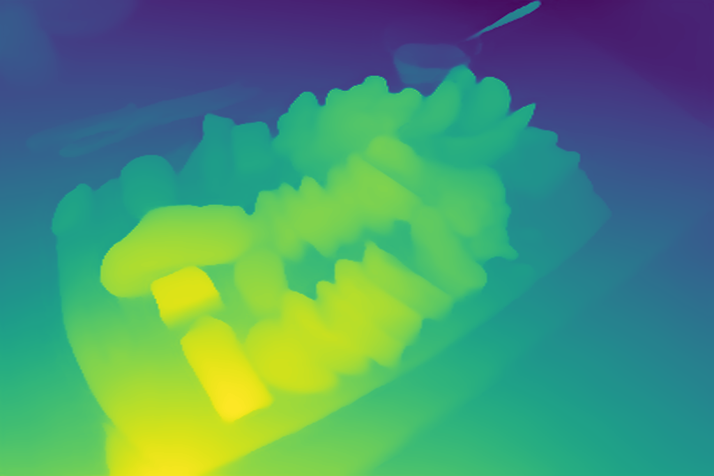
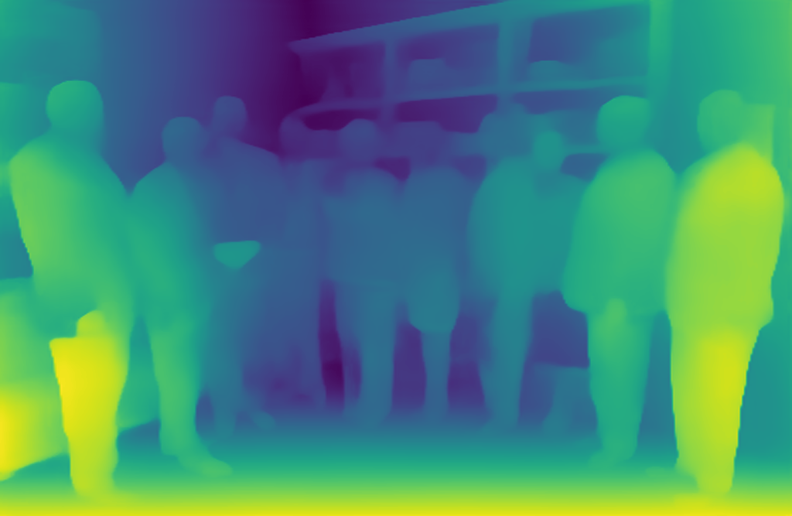
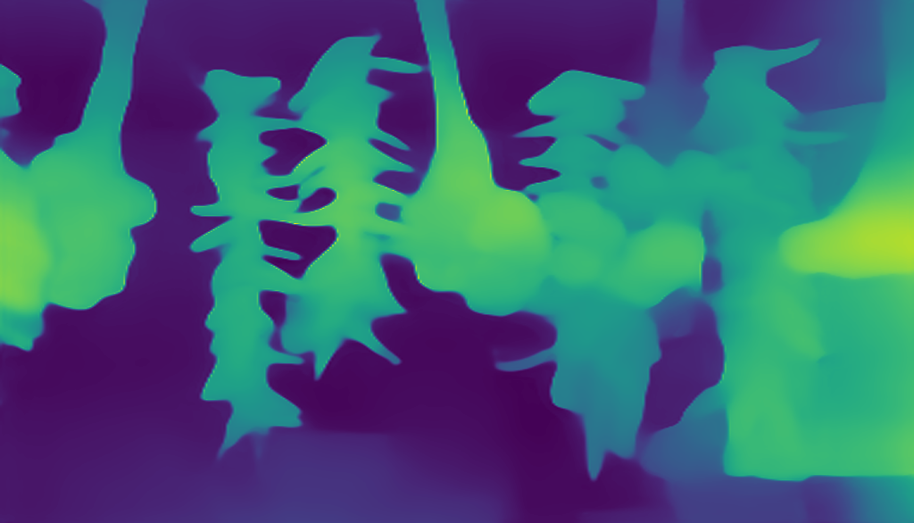
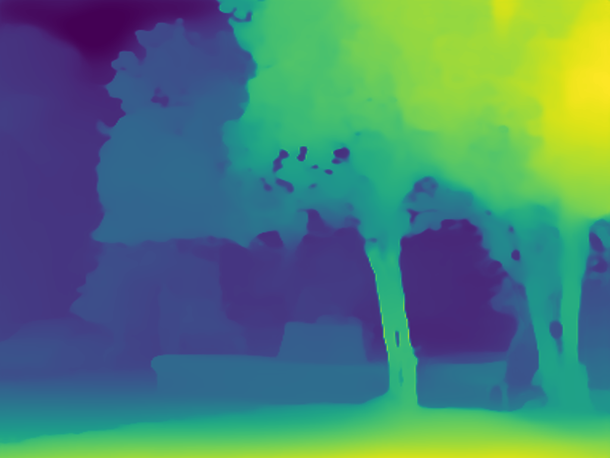

<div align="center">


# Omnidata: _PyTorch Models and Dataloaders_
[`Project Website`](https://omnidata.vision) &centerdot; [`Paper`](https://arxiv.org/abs/2110.04994) &centerdot; [`Github`](https://github.com/EPFL-VILAB/omnidata-tools/tree/main/omnidata_tools/torch) &centerdot; [`Data`](https://github.com/EPFL-VILAB/omnidata/tree/main/omnidata_tools/dataset#readme) &centerdot; [**`>> [PyTorch Utils + Weights] <<`**](https://github.com/EPFL-VILAB/omnidata/tree/main/omnidata_tools/torch#readme) &centerdot;  [`Annotator`](https://github.com/EPFL-VILAB/omnidata-tools/tree/main/omnidata_annotator#readme) 

**Omnidata: A Scalable Pipeline for Making Multi-Task Mid-Level Vision Datasets from 3D Scans (ICCV 2021)**

</div>


---

You can download our pretrained models for surface normal estimation and depth estimation. For each task there are two versions of the models--a V1 used in the paper, and a stronger V2 released in March 2022. 

This repo also contains PyTorch dataloaders to load the starter dataset and other data generated from the Omnidata annotator, and code to train  monocular depth and surface normal estimation. It includes a first publicly available implementation for MiDaS training code. It also contains an implementation of the 3D image refocusing augmentation introduced in the paper.


Table of Contents
=================

   * [Pretrained models for depth and surface normal estimation](#pretrained-models)
   * [Run pretrained models locally](#run-our-models-on-your-own-image)
   * [Dataloaders: Single- and multi-view (3D) dataloaders](#single--and-multi-view-dataloaders)
   * [Training: our public implementation of MiDaS loss our training code](#midas-implementation)
   * [3D Image refocusing augmentation](#3d-image-refocusing)
   * [Train state-of-the-art models on Omnidata](#training-state-of-the-art-models)
     * [Depth Estimation](#depth-estimation)
     * [Surface Normal Estimation](#surface-normal-estimation)
   * [Citing](#citation)


## Pretrained Models
Here is an [online demo](https://omnidata.vision/demo/) where you can upload your own images (1 per CAPTCHA).


### Network Architecture
- **Version 2 models** _(stronger than V1)_ **[March 2022]**: <br> These are DPT architectures trained on more data using both [3D Data Augmentations](https://3dcommoncorruptions.epfl.ch/) and [Cross-Task Consistency](https://consistency.epfl.ch/). Here's the list of updates in Version 2 models:
  - **Monocular Depth Estimation:**
    - [Habitat-Matterport 3D Dataset (HM3D)](https://aihabitat.org/datasets/hm3d/) and 5 [MiDaS](https://github.com/isl-org/MiDaS) dataset components (RedWebDataset, HRWSIDataset, MegaDepthDataset, TartanAirDataset, BlendedMVS) are added to the training data.
    - 1 week of training with 2D and [3D data augmentations](https://3dcommoncorruptions.epfl.ch/) and 1 week of training with [cross-task consistency](https://consistency.epfl.ch/) on 4xV100.
  - **Monocular Surface Normal Estimation:**
    - New model is based on DPT architecture.
    - Habitat-Matterport 3D Dataset (HM3D) is added to the training data.
    - 1 week of training with 2D and [3D data augmentations](https://3dcommoncorruptions.epfl.ch/) and 1 week of training with [cross-task consistency](https://consistency.epfl.ch/) on 4xV100.

- Version 1 Models
  - **Monocular Depth Estimation:**
    - have DPT-based architectures (similar to [MiDaS v3.0](https://github.com/isl-org/MiDaS)) and are trained with scale- and shift-invariant loss and scale-invariant gradient matching term introduced in [MiDaS](https://arxiv.org/pdf/1907.01341v3.pdf), and also [virtual normal loss](https://openaccess.thecvf.com/content_ICCV_2019/papers/Yin_Enforcing_Geometric_Constraints_of_Virtual_Normal_for_Depth_Prediction_ICCV_2019_paper.pdf). We're making our implementation available [here](#midas-implementation), since there is currently no other public implementation. We provide 2 pretrained depth models for both DPT-hybrid and DPT-large architectures with input resolution 384.
  - **Monocular Surface Normal Estimation:**
    - The surface normal network is based on the [UNet](https://arxiv.org/pdf/1505.04597.pdf) architecture (6 down/6 up). It is trained with both angular and L1 loss and input resolutions between 256 and 512.


#### Packages
You can see the complete list of required packages in [requirements.txt](https://github.com/Ainaz99/omnidata-tools/blob/main/requirements.txt). We recommend using conda or virtualenv for the installation.

```bash
conda create -n testenv -y python=3.8
source activate testenv
pip install -r requirements.txt
```

#### Download pretrained models

```bash
sh ./tools/download_depth_models.sh
sh ./tools/download_surface_normal_models.sh
```
These will download the pretrained models for `depth` and `normals` to a folder called `./pretrained_models`.

## Run our models on your own image
After downloading the pretrained models [like above](#pretrained-models), you can run them on your own image with the following command:
```bash
python demo.py --task $TASK --img_path $PATH_TO_IMAGE_OR_FOLDER --output_path $PATH_TO_SAVE_OUTPUT
```
The `--task` flag should be either `normal` or `depth`. To run the script for a `normal` target on an [example image](./assets/demo/test1.png):
```bash
python demo.py --task normal --img_path assets/demo/test1.png --output_path assets/
```
|  |   |   |   |  |  |  |
| :-------------:|:-------------:|:-------------:|:-------------:|:-------------:|:-------------:|:-------------:|
|  |  | |  |  | | |
|  |  | |  |  |  |  |
|  |  |  |  |  |  | 


## Single- and Multi-View Dataloaders
We provide a set of modular PyTorch dataloaders in the `dataloaders` directory ([here](https://github.com/EPFL-VILAB/omnidata/tree/main/omnidata_tools/torch/dataloader)) that work for multiple components of the dataset or for any combination of modalities.
- The [notebook here](https://github.com/EPFL-VILAB/omnidata/blob/main/omnidata_tools/torch/00_usage_dataloader.ipynb) shows how to use the dataloader, how to load multiple overlapping views, and how to unproject the images into the same scene.
- New components datasets (e.g. those annotated with the [annotator](https://github.com/EPFL-VILAB/omnidata/tree/main/omnidata_annotator)) can be added as a file in the `dataloader/component_datasets` and used with the dataloader. The current dataloaders work for Taskonomy, Replica, GSO-in-Replica, Hypersim, HM3D, and BlendedMVS++
- See the [dataloader README](https://github.com/EPFL-VILAB/omnidata/tree/main/omnidata_tools/torch/dataloader) for more info on how to load multiple views, get the camera intrinsics and pose, and use with PyTorch3D or PyTorch-Lightning

| |
| :-------------:|
| Notebook visualization of multiple views |
|  |


## MiDaS Implementation
We provide a public implementation of the MiDaS loss that we used for training. The loss is not available in the original MiDaS repo, and we coudln't find one online. Both the `ssimae (scale- and shift invariant MAE) loss` and the `scale-invariant gradient matching term` are in `losses/midas_loss.py`. MiDaS loss is useful for training depth estimation models on mixed datasets with different depth ranges and scales, similar to our dataset. An example usage is shown below:
```bash
from losses.midas_loss import MidasLoss
midas_loss = MidasLoss(alpha=0.1)
midas_loss, ssi_mae_loss, reg_loss = midas_loss(depth_prediction, depth_gt, mask)
```
`alpha` specifies the weight of the `gradient matching term` in the total loss, and `mask` indicates the valid pixels of the image.
|  |   |   |   |  |  |  |
| :-------------:|:-------------:|:-------------:|:-------------:|:-------------:|:-------------:|:-------------:|
|  |  | |  |  |  |  |
|  |  | |  |  |  |  

## 3D Image Refocusing
Mid-level cues can be used for data augmentations in addition to training targets. The availability of full scene geometry in our dataset makes the possibility of doing Image Refocusing as a 3D data augmentation. You can find an implementation of this augmentation in `data/refocus_augmentation.py`. You can run this augmentation on some sample images from our dataset with the following command. 
```bash
python demo_refocus.py --input_path assets/demo_refocus/ --output_path assets/demo_refocus
```
This will refocus RGB images by blurring them according to `depth_euclidean` for each image. You can specify some parameters of the augmentation with the following tags: `--num_quantiles` (number of qualtiles to use in blur stack), `--min_aperture` (smallest aperture to use), `--max_aperture` (largest aperture to use). Aperture size is selected log-uniformly in the range between min and max aperture. 


| Shallow Focus | Mid Focus | Far Focus |
| :-------------:|:-------------:|:-------------:|
|  |  |

## Training State-of-the-Art Models:
Omnidata is a means to train state-of-the-art models in different vision tasks. Here, we provide the code for training our depth and surface normal estimation models. You can train the models with the following commands:

#### Depth Estimation
We train DPT-based models on Omnidata using 3 different losses: `scale- and shift-invariant loss` and `scale-invariant gradient matching term` introduced in [MiDaS](https://arxiv.org/pdf/1907.01341v3.pdf), and also `virtual normal loss` introduced [here](https://openaccess.thecvf.com/content_ICCV_2019/papers/Yin_Enforcing_Geometric_Constraints_of_Virtual_Normal_for_Depth_Prediction_ICCV_2019_paper.pdf).
```bash
python train_depth.py --config_file config/depth.yml --experiment_name rgb2depth --val_check_interval 3000 --limit_val_batches 100 --max_epochs 10
```
#### Surface Normal Estimation
We train a [UNet](https://arxiv.org/pdf/1505.04597.pdf) architecture (6 down/6 up) for surface normal estimation using `L1 Loss` and `Cosine Angular Loss`.
```bash
python train_normal.py --config_file config/normal.yml --experiment_name rgb2normal --val_check_interval 3000 --limit_val_batches 100 --max_epochs 10
```
## Citation
If you find the code or models useful, please cite our paper:
```
@inproceedings{eftekhar2021omnidata,
  title={Omnidata: A Scalable Pipeline for Making Multi-Task Mid-Level Vision Datasets From 3D Scans},
  author={Eftekhar, Ainaz and Sax, Alexander and Malik, Jitendra and Zamir, Amir},
  booktitle={Proceedings of the IEEE/CVF International Conference on Computer Vision},
  pages={10786--10796},
  year={2021}
}
```
In case you use our latest pretrained models please also cite the following paper:
```
@inproceedings{kar20223d,
  title={3D Common Corruptions and Data Augmentation},
  author={Kar, O{\u{g}}uzhan Fatih and Yeo, Teresa and Atanov, Andrei and Zamir, Amir},
  booktitle={Proceedings of the IEEE/CVF Conference on Computer Vision and Pattern Recognition},
  pages={18963--18974},
  year={2022}
}
```
